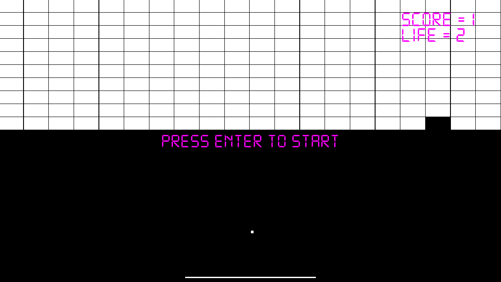

# pong
implement Bat-and-ball using SFML

<strong>Break 🧱 with 🎱</strong>

## How to play?
move bat with ⬅️ ➡️

## How to SetUp?

1. Clone this project
2. Create <strong>pong-bin</strong> flofer.
3. pong-bin floder includes sfml dll files and assets
4. Build and Execute!

## Contributors

* Choi Ye Ji
* Ye Lim Park
* Song Ha Jeong

## Reference

https://github.com/PacktPublishing/Beginning-Cpp-Game-Programming-Second-Edition

-------

in 2022 KGA mobile game class
